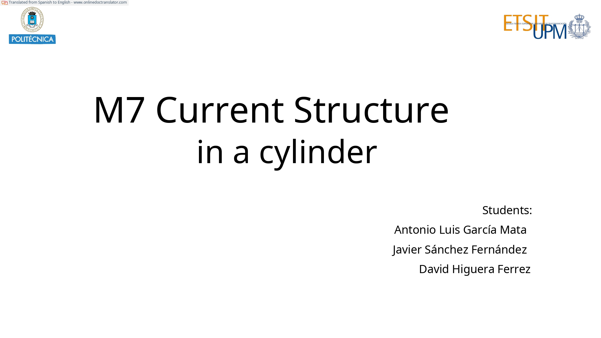
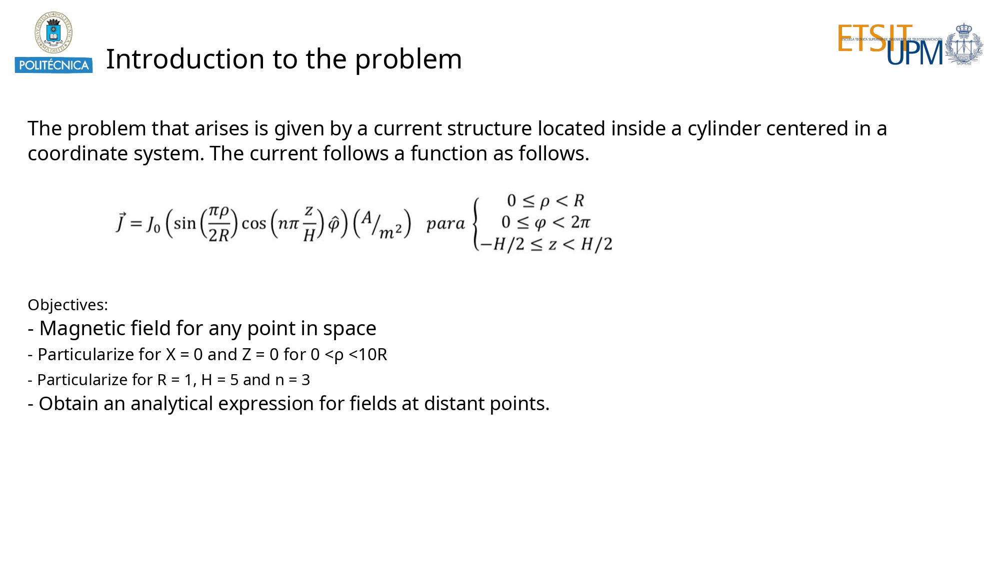
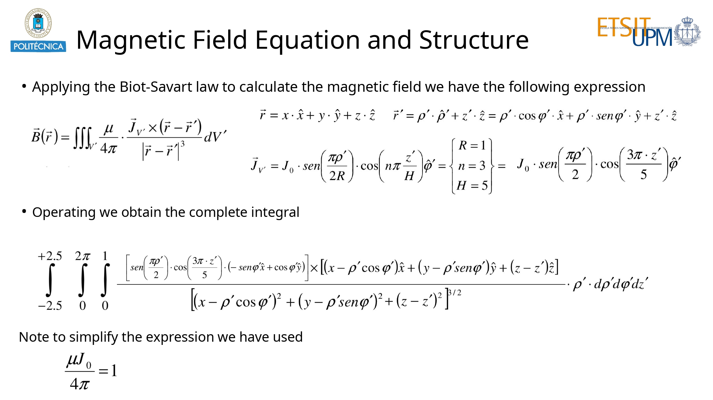
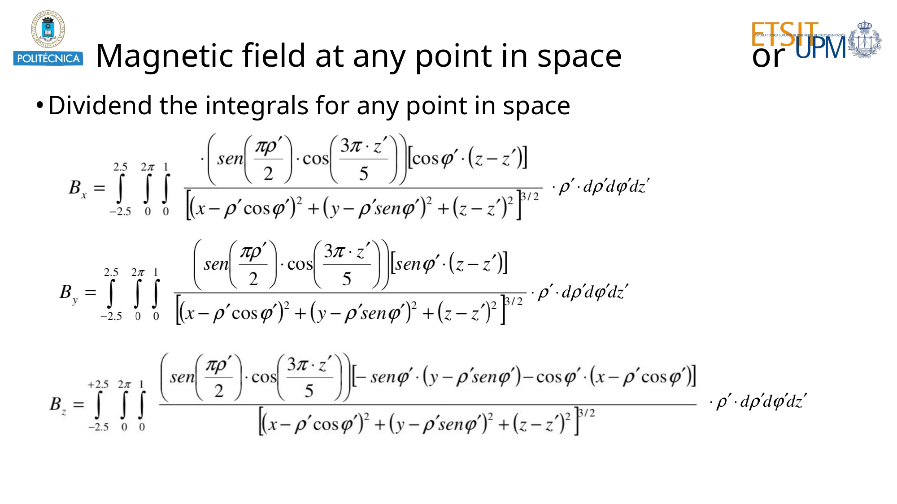
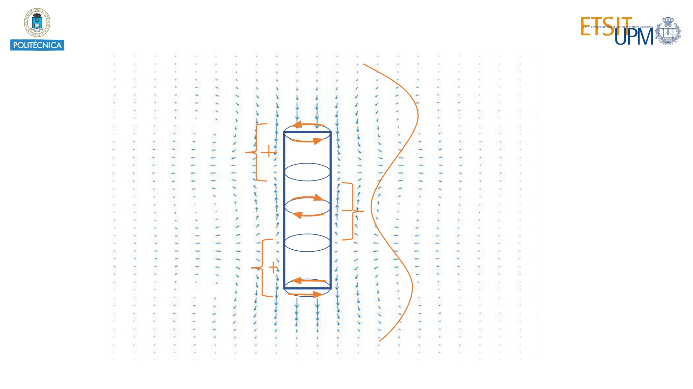
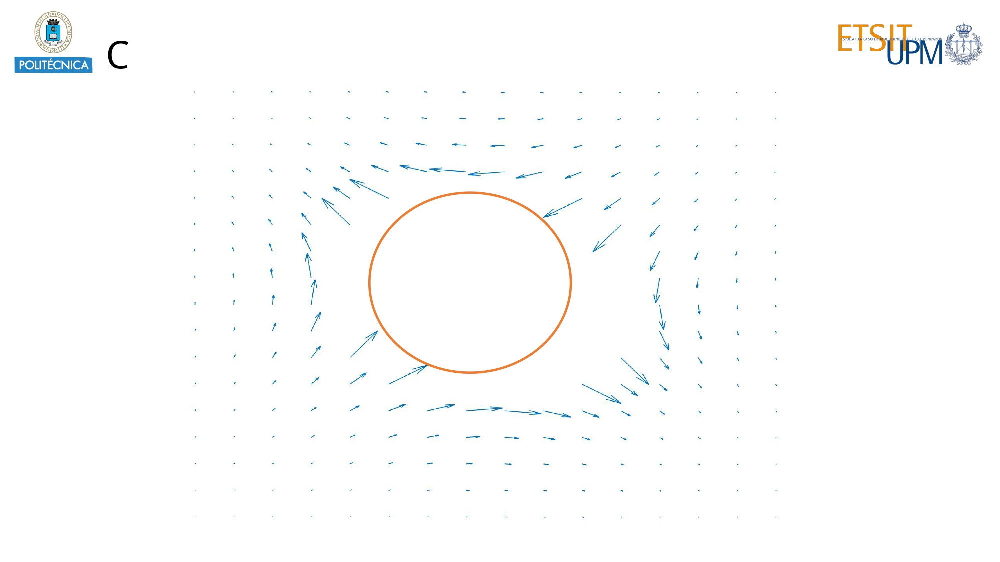
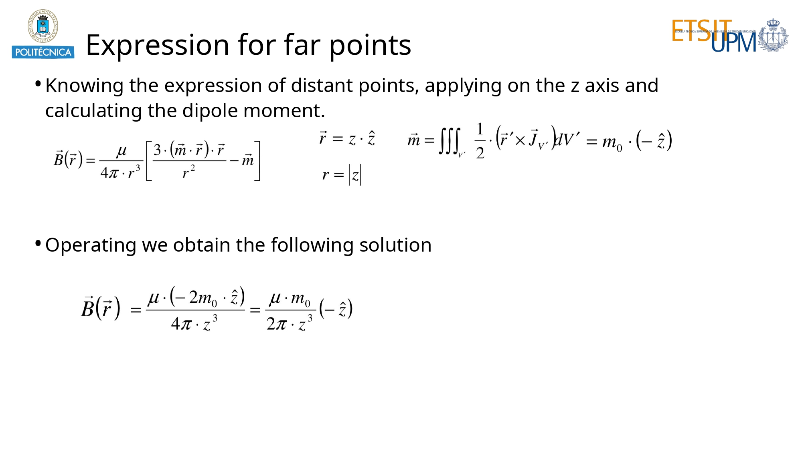
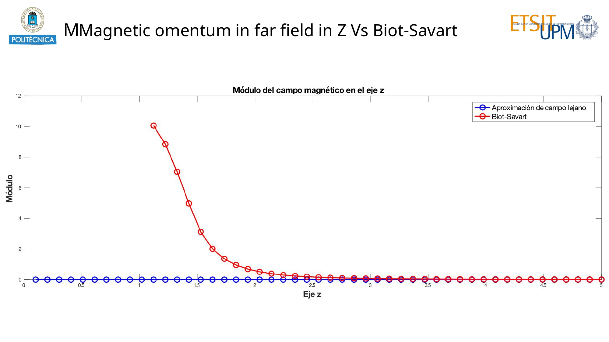
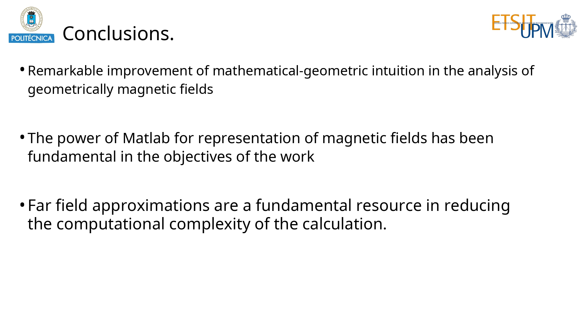

# Electromegnetic simulation of a current structure

This repository contains a electromagnetic simulation of a cylinder current structure.

## Run the simulation with the default parameters (Presentation)

If you want to **see the results** with the default data just load the `.mat` files and run the `simulation.m` file.

## Run the simulation with your own data

If you want to **run your own simulation**, **be careful!** The simulation with the current parameters in a beefy PC takes almost 12 hours. So, **be gentle with the point density!**

